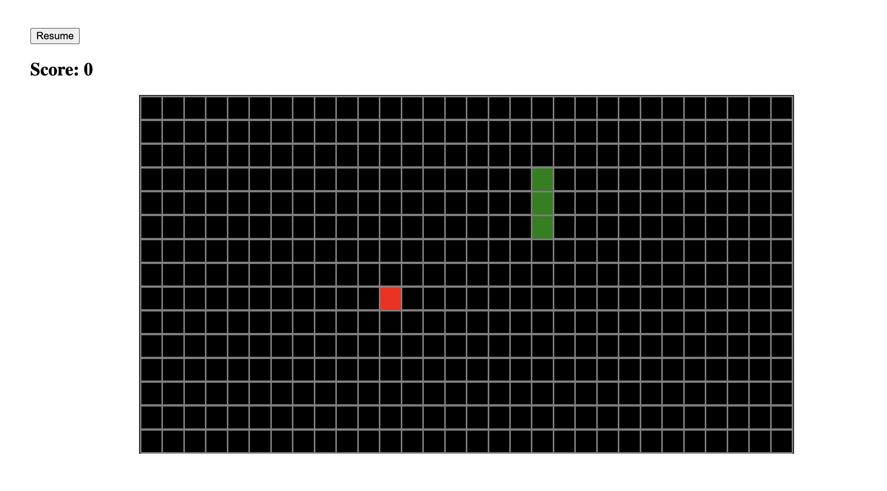
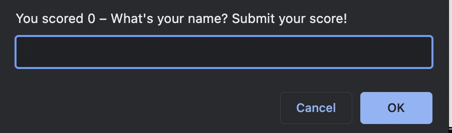
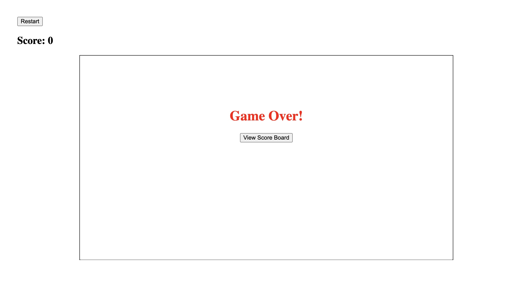
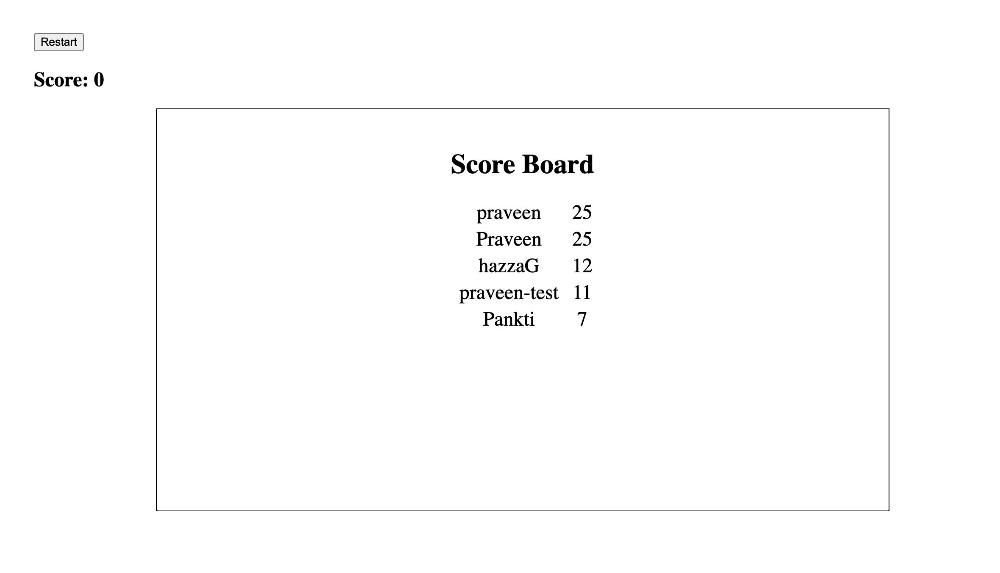

**Project: Snake Game**

This repository contains the classic snake game built using Java Script with an OOP approach. The snake class stores two different states of the snake i.e. currentVelocity and updateVelocity. This ensures that the snake renders in line with the game rules & speed settings.

### Rules of the Game

- The user controls a 'snake' around a game area (the 'board')
- The snake is in continuous motion (up, down, left, or right) and the user can change its direction using the arrow keys
- The snake has to eat an apple which is randomly placed on the board
- When the snake eats the apple:
    - The user's score is increased
    - The snake's length is increased
    - The snake's speed is increased
    - A new apple is placed randomly on the board
If the snake hits the edge of the board, or its own tail, the game is over

### Landing Page

### Submit Score

### Game Over

### Score Board

